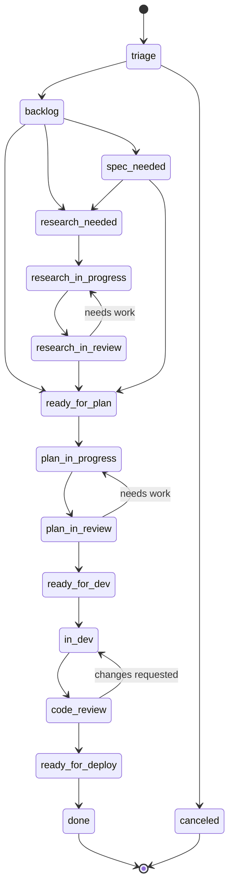

# IDLC: Idea Development Lifecycle

## Overview

The **Idea Development Lifecycle (IDLC)** is PMSynapse's configurable framework for guiding ideas from inception to implementation. Unlike rigid project management systems, IDLC recognizes that different teams, domains, and project types require different workflows.

> **Core Principle**: Every team can customize their own IDLC to match their working style, domain requirements, and organizational constraints.

---

## What is IDLC?

IDLC defines the complete journey of an idea:

```
┌─────────────────────────────────────────────────────────────────────────────┐
│                    IDEA DEVELOPMENT LIFECYCLE (IDLC)                         │
├─────────────────────────────────────────────────────────────────────────────┤
│                                                                              │
│    💡 IDEA                                                                  │
│       │                                                                      │
│       ▼                                                                      │
│    🔍 RESEARCH          "Is this idea viable?"                              │
│       │                                                                      │
│       ▼                                                                      │
│    📋 SPECIFICATION     "What exactly are we building?"                     │
│       │                                                                      │
│       ▼                                                                      │
│    🏗️ ARCHITECTURE      "How will we build it?"                             │
│       │                                                                      │
│       ▼                                                                      │
│    📝 PLANNING          "What are the steps?"                               │
│       │                                                                      │
│       ▼                                                                      │
│    💻 IMPLEMENTATION    "Build it"                                          │
│       │                                                                      │
│       ▼                                                                      │
│    ✅ VALIDATION        "Does it work?"                                     │
│       │                                                                      │
│       ▼                                                                      │
│    🚀 DELIVERY          "Ship it"                                           │
│                                                                              │
└─────────────────────────────────────────────────────────────────────────────┘
```

### IDLC vs Traditional PM

| Traditional PM | IDLC |
|----------------|------|
| Fixed stages for all projects | Configurable stages per team |
| One workflow fits all | Multiple workflow templates |
| Manual status tracking | Graph-based state machine |
| Siloed documentation | Unified knowledge graph |
| Tool-specific | Tool-agnostic (Linear, Jira, GitHub) |

---

## Team Configuration

### Configuration Structure

Each team defines their IDLC in a configuration file:

```
.pmsynapse/
├── config.yaml                    # Global settings
├── teams/
│   ├── platform/
│   │   ├── idlc.yaml             # Platform team IDLC
│   │   ├── agents/               # Custom agents
│   │   └── workflows/            # Custom workflows
│   ├── mobile/
│   │   ├── idlc.yaml             # Mobile team IDLC
│   │   └── ...
│   ├── ml-research/
│   │   ├── idlc.yaml             # ML team IDLC (research-heavy)
│   │   └── ...
│   └── devops/
│       ├── idlc.yaml             # DevOps team IDLC (ops-focused)
│       └── ...
└── shared/
    ├── stages/                   # Reusable stage definitions
    ├── statuses/                 # Reusable status definitions
    └── transitions/              # Reusable transition rules
```

### Team IDLC Configuration

```yaml
# .pmsynapse/teams/platform/idlc.yaml

team:
  id: platform
  name: "Platform Engineering"
  description: "Core infrastructure and developer tools"

# Inherit from base or start fresh
extends: default  # or: null for custom from scratch

# =============================================================================
# STAGES: The major phases of your IDLC
# =============================================================================
stages:
  - id: triage
    name: "Triage"
    description: "Initial intake and categorization"
    required: true
    entry_criteria: []
    exit_criteria:
      - "Has priority assigned"
      - "Has owner assigned"

  - id: backlog
    name: "Backlog"
    description: "Prioritized queue of accepted work"
    required: true

  - id: research
    name: "Research"
    description: "Investigation and discovery phase"
    required: false  # Can be skipped for simple tasks
    skip_conditions:
      - complexity: ["trivial", "simple"]
      - type: ["bug", "chore"]

  - id: planning
    name: "Planning"
    description: "Specification and design"
    required: true

  - id: development
    name: "Development"
    description: "Implementation phase"
    required: true

  - id: validation
    name: "Validation"
    description: "Review and testing"
    required: true

  - id: delivery
    name: "Delivery"
    description: "Deployment and release"
    required: true

  - id: completed
    name: "Completed"
    description: "Successfully finished"
    terminal: true

  - id: canceled
    name: "Canceled"
    description: "Work stopped"
    terminal: true

# =============================================================================
# STATUSES: The specific states within each stage
# =============================================================================
statuses:
  # Triage stage
  - id: triage
    stage: triage
    name: "Triage"
    color: "#6B7280"

  # Backlog stage
  - id: backlog
    stage: backlog
    name: "Backlog"
    color: "#9CA3AF"

  - id: postits
    stage: backlog
    name: "Post-its"
    description: "Quick notes and ideas"
    color: "#FCD34D"

  # Research stage
  - id: research-needed
    stage: research
    name: "Research Needed"
    color: "#F59E0B"

  - id: research-in-progress
    stage: research
    name: "Research In Progress"
    color: "#F97316"

  - id: research-in-review
    stage: research
    name: "Research In Review"
    color: "#FB923C"

  # Planning stage
  - id: spec-needed
    stage: planning
    name: "Spec Needed"
    color: "#8B5CF6"

  - id: ready-for-plan
    stage: planning
    name: "Ready for Plan"
    color: "#A78BFA"

  - id: plan-in-progress
    stage: planning
    name: "Plan In Progress"
    color: "#7C3AED"

  - id: plan-in-review
    stage: planning
    name: "Plan In Review"
    color: "#6D28D9"

  # Development stage
  - id: ready-for-dev
    stage: development
    name: "Ready for Dev"
    color: "#3B82F6"

  - id: in-dev
    stage: development
    name: "In Development"
    color: "#2563EB"

  # Validation stage
  - id: code-review
    stage: validation
    name: "Code Review"
    color: "#10B981"

  - id: in-qa
    stage: validation
    name: "In QA"
    color: "#059669"

  # Delivery stage
  - id: ready-for-deploy
    stage: delivery
    name: "Ready for Deploy"
    color: "#06B6D4"

  - id: deploying
    stage: delivery
    name: "Deploying"
    color: "#0891B2"

  # Terminal stages
  - id: done
    stage: completed
    name: "Done"
    color: "#22C55E"

  - id: canceled
    stage: canceled
    name: "Canceled"
    color: "#EF4444"

# =============================================================================
# TRANSITIONS: Allowed state changes
# =============================================================================
transitions:
  # From Triage
  - from: triage
    to: [backlog, canceled]

  # From Backlog
  - from: backlog
    to: [research-needed, spec-needed, ready-for-plan, canceled]

  - from: postits
    to: [backlog, canceled]

  # Research flow
  - from: research-needed
    to: [research-in-progress, canceled]

  - from: research-in-progress
    to: [research-in-review, canceled]

  - from: research-in-review
    to: [research-in-progress, ready-for-plan, canceled]  # Can loop back

  # Planning flow
  - from: spec-needed
    to: [research-needed, ready-for-plan]

  - from: ready-for-plan
    to: [plan-in-progress]

  - from: plan-in-progress
    to: [plan-in-review, canceled]

  - from: plan-in-review
    to: [plan-in-progress, ready-for-dev, canceled]  # Can loop back

  # Development flow
  - from: ready-for-dev
    to: [in-dev]

  - from: in-dev
    to: [code-review, canceled]

  # Validation flow
  - from: code-review
    to: [in-dev, in-qa, ready-for-deploy]  # Can loop back to dev

  - from: in-qa
    to: [in-dev, ready-for-deploy]  # Can loop back to dev

  # Delivery flow
  - from: ready-for-deploy
    to: [deploying]

  - from: deploying
    to: [done, in-dev]  # Can roll back

  # Universal: can cancel from most states
  - from: "*"
    to: [canceled]
    except: [done, canceled]

# =============================================================================
# AUTOMATION: Rules for automatic transitions and actions
# =============================================================================
automation:
  # Auto-assign when entering research
  - trigger: status_changed
    to: research-in-progress
    actions:
      - assign_if_unassigned: true
      - create_graph_node:
          type: Research
          link_to_issue: true

  # Auto-move when PR is created
  - trigger: pr_created
    from: in-dev
    to: code-review

  # Auto-move when PR is merged
  - trigger: pr_merged
    from: [code-review, ready-for-deploy]
    to: done

  # Auto-create plan document
  - trigger: status_changed
    to: plan-in-progress
    actions:
      - create_document:
          template: plan-template
          path: "docs/plans/{{issue.id}}-{{issue.slug}}.md"

  # Notify on blocking
  - trigger: blocked
    actions:
      - notify:
          channel: "#platform-alerts"
          message: "🚨 {{issue.id}} is blocked: {{block.reason}}"

# =============================================================================
# COMPLEXITY RULES: How complexity affects the workflow
# =============================================================================
complexity:
  levels:
    - id: trivial
      name: "Trivial"
      points: 1
      skip_stages: [research, planning]

    - id: simple
      name: "Simple"
      points: 2-3
      skip_stages: [research]

    - id: medium
      name: "Medium"
      points: 5
      skip_stages: []

    - id: complex
      name: "Complex"
      points: 8
      required_stages: [research, planning]
      require_approval:
        - stage: planning
          approvers: ["tech-lead"]

    - id: epic
      name: "Epic"
      points: 13+
      required_stages: [research, planning]
      require_approval:
        - stage: research
          approvers: ["tech-lead", "product"]
        - stage: planning
          approvers: ["tech-lead", "architect"]

# =============================================================================
# INTEGRATIONS: External tool mappings
# =============================================================================
integrations:
  linear:
    enabled: true
    team_id: ${LINEAR_PLATFORM_TEAM_ID}
    status_mapping:
      triage: "Triage"
      backlog: "Backlog"
      research-in-progress: "In Progress"
      in-dev: "In Progress"
      code-review: "In Review"
      done: "Done"
      canceled: "Canceled"

  github:
    enabled: true
    repo: "org/platform"
    label_prefix: "idlc:"

  slack:
    enabled: true
    channel: "#platform-engineering"
    notifications:
      - on: blocked
      - on: ready-for-deploy
      - on: done

# =============================================================================
# GRAPH INTEGRATION: How IDLC interacts with knowledge graph
# =============================================================================
graph:
  # Create nodes at these transitions
  create_nodes:
    - on_enter: research-in-progress
      node_type: Research

    - on_enter: plan-in-progress
      node_type: Plan

    - on_enter: in-dev
      node_type: Implementation

    - on_enter: done
      node_type: Completion

  # Link relationships
  relationships:
    - from_status: research-in-review
      to_status: ready-for-plan
      edge_type: "informs"

    - from_status: plan-in-review
      to_status: ready-for-dev
      edge_type: "enables"

    - from_status: code-review
      to_status: done
      edge_type: "completes"
```

---

## Team Configuration Examples

### ML Research Team (Research-Heavy)

```yaml
# .pmsynapse/teams/ml-research/idlc.yaml

team:
  id: ml-research
  name: "ML Research"

extends: null  # Custom from scratch

stages:
  - id: hypothesis
    name: "Hypothesis"
    description: "Initial research question"

  - id: literature-review
    name: "Literature Review"
    description: "Survey existing work"

  - id: experiment-design
    name: "Experiment Design"
    description: "Design experiments"

  - id: experimentation
    name: "Experimentation"
    description: "Run experiments"

  - id: analysis
    name: "Analysis"
    description: "Analyze results"

  - id: documentation
    name: "Documentation"
    description: "Write up findings"

  - id: productionization
    name: "Productionization"
    description: "Move to production"
    required: false  # Research may not go to prod

  - id: completed
    name: "Completed"
    terminal: true

statuses:
  # Hypothesis
  - id: new-hypothesis
    stage: hypothesis
    name: "New Hypothesis"

  - id: hypothesis-review
    stage: hypothesis
    name: "Hypothesis Review"

  # Literature Review
  - id: lit-review-needed
    stage: literature-review
    name: "Lit Review Needed"

  - id: lit-review-in-progress
    stage: literature-review
    name: "Reviewing Literature"

  - id: lit-review-complete
    stage: literature-review
    name: "Lit Review Complete"

  # Experiment Design
  - id: designing-experiment
    stage: experiment-design
    name: "Designing Experiment"

  - id: experiment-design-review
    stage: experiment-design
    name: "Design Review"

  # Experimentation
  - id: experiment-queued
    stage: experimentation
    name: "Experiment Queued"

  - id: experiment-running
    stage: experimentation
    name: "Experiment Running"

  - id: experiment-complete
    stage: experimentation
    name: "Experiment Complete"

  # Analysis
  - id: analyzing-results
    stage: analysis
    name: "Analyzing Results"

  - id: results-review
    stage: analysis
    name: "Results Review"

  # Documentation
  - id: writing-paper
    stage: documentation
    name: "Writing Paper"

  - id: paper-review
    stage: documentation
    name: "Paper Review"

  # Productionization (optional)
  - id: ready-for-prod
    stage: productionization
    name: "Ready for Prod"

  - id: productionizing
    stage: productionization
    name: "Productionizing"

  # Terminal
  - id: published
    stage: completed
    name: "Published"

  - id: archived
    stage: completed
    name: "Archived"

# Allow looping back (experiments often iterate)
transitions:
  - from: experiment-complete
    to: [analyzing-results, designing-experiment]  # Can redesign

  - from: results-review
    to: [analyzing-results, designing-experiment, writing-paper]  # Can iterate
```

### DevOps Team (Ops-Focused)

```yaml
# .pmsynapse/teams/devops/idlc.yaml

team:
  id: devops
  name: "DevOps"

extends: default

# Override stages to add ops-specific ones
stages:
  - id: triage
    name: "Triage"

  - id: assessment
    name: "Assessment"
    description: "Impact and risk assessment"

  - id: planning
    name: "Planning"

  - id: implementation
    name: "Implementation"

  - id: testing
    name: "Testing"
    description: "Staging validation"

  - id: rollout
    name: "Rollout"
    description: "Progressive deployment"

  - id: monitoring
    name: "Monitoring"
    description: "Post-deploy observation"

  - id: completed
    name: "Completed"
    terminal: true

statuses:
  # Assessment
  - id: assessing-impact
    stage: assessment
    name: "Assessing Impact"

  - id: assessing-risk
    stage: assessment
    name: "Assessing Risk"

  - id: assessment-review
    stage: assessment
    name: "Assessment Review"

  # Rollout (progressive deployment)
  - id: canary
    stage: rollout
    name: "Canary (1%)"

  - id: limited
    stage: rollout
    name: "Limited (10%)"

  - id: half
    stage: rollout
    name: "Half (50%)"

  - id: full
    stage: rollout
    name: "Full (100%)"

  # Monitoring
  - id: observing
    stage: monitoring
    name: "Observing"
    duration: "24h"  # Minimum time in this state

  - id: stable
    stage: monitoring
    name: "Stable"

automation:
  # Require runbook before rollout
  - trigger: status_changed
    to: canary
    conditions:
      - has_document: "runbook"
      - has_document: "rollback-plan"

  # Auto-progress rollout if metrics are healthy
  - trigger: metrics_healthy
    from: canary
    duration: "1h"
    to: limited

  - trigger: metrics_healthy
    from: limited
    duration: "2h"
    to: half

  - trigger: metrics_healthy
    from: half
    duration: "4h"
    to: full

  # Auto-rollback on alerts
  - trigger: alert_fired
    from: [canary, limited, half, full]
    actions:
      - rollback: true
      - notify:
          channel: "#devops-alerts"
          severity: critical
```

---

## CLI Commands for Team Configuration

```bash
# Team management
snps team list                       # List all teams
snps team show <team-id>             # Show team config
snps team create <team-id>           # Create new team
snps team switch <team-id>           # Switch active team context

# IDLC management
snps idlc show                       # Show current team's IDLC
snps idlc validate                   # Validate IDLC config
snps idlc visualize                  # Generate workflow diagram
snps idlc export --format mermaid    # Export as Mermaid diagram

# Status management
snps status list                     # List all statuses for current team
snps status transitions <status>     # Show allowed transitions from status

# Configuration
snps config team.<key> <value>       # Set team config value
snps config --team <team-id> show    # Show team config
```

---

## IDLC Visualization

Generate workflow diagrams from config:

```bash
snps idlc visualize --output workflow.png
```

Example output:



---

## Shared Components

Teams can share and reuse IDLC components:

```yaml
# .pmsynapse/shared/stages/research.yaml

# Reusable research stage definition
stage:
  id: research
  name: "Research"
  statuses:
    - id: research-needed
      name: "Research Needed"
    - id: research-in-progress
      name: "Research In Progress"
    - id: research-in-review
      name: "Research In Review"
  transitions:
    - from: research-needed
      to: research-in-progress
    - from: research-in-progress
      to: research-in-review
    - from: research-in-review
      to: [research-in-progress]  # Can loop back
```

Reference shared components:

```yaml
# .pmsynapse/teams/platform/idlc.yaml

stages:
  - $ref: shared/stages/research.yaml
  - $ref: shared/stages/development.yaml
  - id: custom-stage
    name: "Our Custom Stage"
    # ...custom definition
```

---

## IDLC Metrics and Analytics

Track IDLC performance:

```yaml
# .pmsynapse/teams/platform/idlc.yaml

metrics:
  track:
    - cycle_time           # Time from backlog to done
    - stage_duration       # Time in each stage
    - transition_count     # Number of state changes
    - loop_back_rate       # How often items go backwards
    - blocked_time         # Time spent blocked

  alerts:
    - metric: stage_duration
      stage: code-review
      threshold: "3d"
      action: notify

    - metric: loop_back_rate
      threshold: "30%"
      action: report

  dashboards:
    - name: "IDLC Health"
      widgets:
        - type: funnel
          stages: [backlog, in-dev, code-review, done]
        - type: cycle_time
          percentiles: [50, 90, 99]
        - type: bottleneck
          highlight_threshold: "2d"
```

---

## Summary

### IDLC Core Concepts

| Concept | Description |
|---------|-------------|
| **Stage** | Major phase of the lifecycle (Research, Development, etc.) |
| **Status** | Specific state within a stage (in-dev, code-review) |
| **Transition** | Allowed movement between statuses |
| **Automation** | Rules that trigger actions on transitions |
| **Complexity** | Rules that modify workflow based on item complexity |

### Configuration Hierarchy

```
Global defaults
    └── Team base config (extends)
        └── Team overrides
            └── Project overrides (optional)
```

### Key Benefits

1. **Team autonomy**: Each team defines their own workflow
2. **Consistency**: Shared components ensure common patterns
3. **Visibility**: Unified knowledge graph tracks all work
4. **Flexibility**: Easy to modify without code changes
5. **Integration**: Works with Linear, GitHub, Jira, etc.

---

*Document version: 1.0*
*Created: December 2025*
*Part of: PMSynapse IDLC Documentation*
